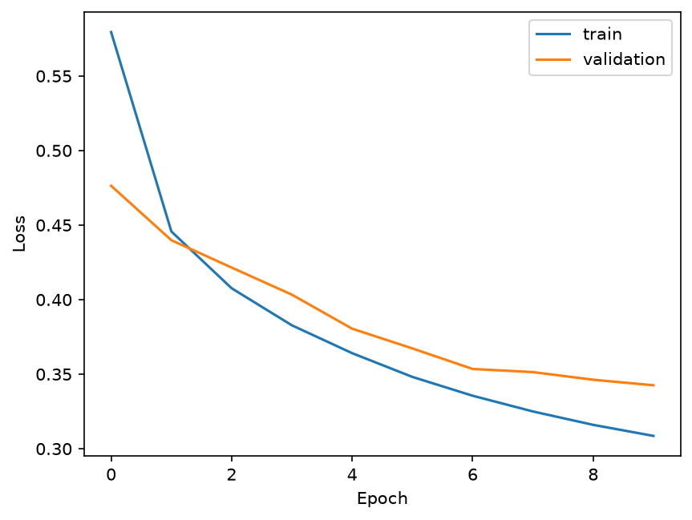
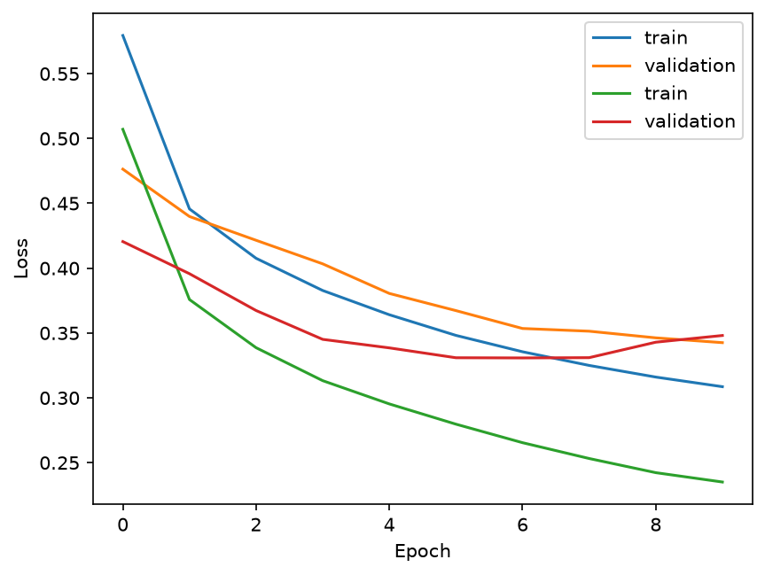

# Revision History

| Date | Activity |
|------|----------|
| Sep 30, 2026 | Initial version - single model, no validation, no test |
| Oct 1, 2026  | Add validation and test runs. Create a class for the model. |

# Notes

According to [this site](https://github.com/zalandoresearch/fashion-mnist), human
performance was observed to be around 83.5%. With the two models here, we see a
performance of 88.2% for VerySimpleFashionModel, and 88.6% for SimpleFashionModel.

The learning curves are below:

  
   
  
<b>Very Simple Fashion Model</b>

  
  
<b>Simple Fashion Model</b>

